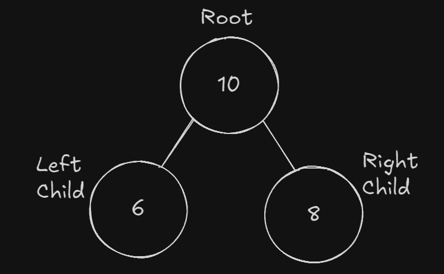

# Árvores Binárias
Uma **árvore binária** é uma estrutura de dados de árvore na qual cada nó tem no máximo dois filhos, chamados de filho esquerdo e filho direito. Cada nó em uma árvore binária pode ter zero, um ou dois filhos, e sua estrutura consiste em:

- Dado.
- Ponteiro para o filho esquerdo.
- Ponteiro para o filho direito.

---

## Propriedades de Árvores Binárias

- O número máximo de nós em um nível L de uma árvore binária é *2 ^ L.*
- O número máximo de nós em uma árvore binária de altura H é *2 ^ H - 1.*
- O número total de folhas em uma árvore binária é o *total de nós com 2 filhos + 1*
- Em uma árvore binária com N nós, a altura mínima ou o mínimo de níveis é *Log2(N + 1).*
- Uma árvore binária com F folhas tem pelo menos *| Log2L | + 1* níveis.

---

## Tipos de Árvore Binária

Árvores binárias podem ser classificadas em vários tipos de acordo com alguns fatores:

### Árvore Binária Cheia ou Estritamente Binária

- Todo nó tem 0 ou 2 filhos.
- Nenhum nó tem apenas 1 filho.
- Nós internos sempre tem 2 filhos.

### Árvore Binária Completa

- Todos os níveis da árvore são completamente preenchidos, exceto possivelmente pelo último nível.
- Todos os nós do último nível estão tanto quanto o possível à esquerda.

### Árvore Binária Perfeita

- Todos os níveis estão completamente preenchidos.
- Todas as folhas estão no mesmo nível.
- Todos os nós internos tem grau 2.
- É uma árvore binária cheia ou estritamente binária.

---

## Travessias / Transversais

Travessia ou transversal é o processo de visitar todos os nós em uma árvore. Diferentes técnicas de travessia fornecem várias maneiras de acessar e processar os nós. Técnicas essenciais de travessia para árvores binárias incluem:

### **Busca em Profundidade (DFS):**

- **Travessia em pré-ordem(Preorder Transversal)** :  Visita a raiz, depois a subárvore esquerda e, por fim, a subárvore direita.
- **Travessia em ordem(Inorder Transversal):** Visita a subárvore esquerda, depois a raiz e, por fim, a subárvore direita.
- **Travessia em pós-ordem(Postorder transversal):** Visita a subárvore esquerda, depois a subárvore direita e, por fim, a raiz.

### Busca em Largura (BFS):

- **Travessia em nível(Level Order Transversal)**: Visita todos os nós em um nível antes de passar para o próximo nível.

---