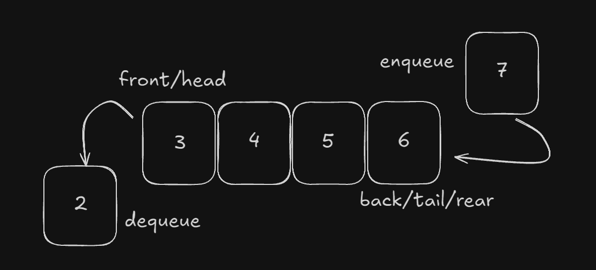

# Fila
Uma fila é uma estrutura de dados linear que segue o princípio FIFO (First In, First Out), onde o primeiro elemento adicionado é o primeiro a ser removido. Ela pode ser visualizada como uma fila de pessoas esperando para serem atendidas, onde a primeira pessoa da fila é a primeira a ser atendida, e as novas pessoas se juntam no final da fila.

---

## Tipos de Fila

- **Fila Estática**: Implementada usando um array de tamanho fixo, onde a capacidade da fila é definida no momento da criação e não pode ser alterada.
- **Fila Dinâmica**: Implementada usando listas encadeadas, permitindo que a fila cresça ou diminua conforme necessário, sem limitações de capacidade fixa.

Além das filas simples, existem variações que adaptam o comportamento para diferentes cenários:

- **Fila Circular**: Uma otimização da fila estática onde o último elemento do array "conecta" ao primeiro, permitindo um uso mais eficiente do espaço.
- **Fila de Prioridade**: Aqui, os elementos são removidos com base em sua prioridade, e não apenas na ordem de chegada.
- **Deque (Double-Ended Queue)**: Uma fila em que elementos podem ser inseridos e removidos tanto pelo início quanto pelo final.

---

## Operações em Filas

As filas oferecem um conjunto básico de operações que incluem:

- **Enfileirar (Enqueue)**: Adiciona um elemento ao final da fila.
- **Desenfileirar (Dequeue)**: Remove e retorna o elemento do início da fila.
- **Frente (Front)**: Retorna o elemento no início da fila sem removê-lo.
- **Trás (Rear)**: Retorna o elemento no final da fila sem removê-lo.
- **EstaVazia (IsEmpty)**: Verifica se a fila está vazia.
- **EstaCheia (IsFull)**: Verifica se a fila está cheia (apenas em filas estáticas).

---

## Funcionamento da Fila

- Dois ponteiros, geralmente chamados de **`início`** e **`fim`**, são usados para controlar a inserção e remoção de elementos.
- O ponteiro **`início`** indica o primeiro elemento da fila (o próximo a ser removido), e o **`fim`** aponta para o local onde o próximo elemento será inserido.
- Ao enfileirar, incrementamos o ponteiro **`fim`** e inserimos o novo elemento na posição indicada.
- Ao desenfileirar, retornamos o primeiro elemento da fila, e incrementamos o ponteiro **`início`**.
- Antes de enfileirar, verificamos se a fila está cheia (em filas estáticas) ou se o ponteiro **`fim`** atingiu o limite do array.
- Antes de desenfileirar, verificamos se a fila está vazia comparando se o **`início`** é igual ao **`fim`**.

---

## Aplicações da Fila

- **Sistemas de Impressão**: Em filas de impressão, os trabalhos são atendidos na ordem em que foram recebidos.
- **Gerenciamento de Processos**: Usadas em sistemas operacionais para organizar a execução de processos.
- **Lógica de Atendimento**: Usadas em filas de espera, como em serviços de atendimento ao cliente.

---

## Complexidade

| Operações | Complexidade |
| --- | --- |
| enqueue() | O(1) |
| dequeue() | O(1) |
| front() | O(1) |
| rear() | O(1) |
| isEmpty() | O(1) |
| isFull() | O(1) |

---