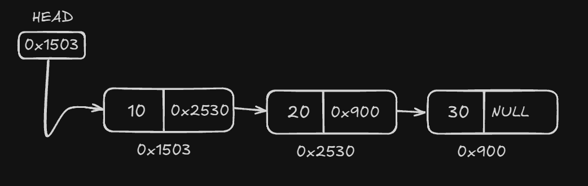

# Listas Encadeadas

Uma lista encadeada é uma estrutura de dados linear e dinâmica composta por elementos chamados nós. Cada nó contém dois campos principais: o dado, que armazena o valor do elemento, e um ponteiro, que aponta para o próximo nó na lista.

Essa estrutura é eficiente para inserções e remoções em posições arbitrárias, pois não requer realocação de memória ou movimentação de elementos, ao contrário de arrays.



---

## Tipos de Listas Encadeadas
As listas encadeadas podem ser classificadas em diferentes tipos com base na organização de seus nós:

* **Lista Simplesmente Encadeada**: Cada nó aponta apenas para o próximo nó. O último nó aponta para ```null```.

* **Lista Duplamente Encadeada**: Cada nó possui dois ponteiros, um para o próximo nó e outro para o nó anterior.

* **Lista Circular**: Pode ser simplesmente ou duplamente encadeada, mas o último nó aponta para o primeiro, formando um ciclo.

---

## Operações em Listas Encadeadas

* **Inserção**:
  * **No início**: Um novo nó é inserido antes do primeiro nó.

  * **No meio**: Um novo nó é inserido entre dois nós existentes.

  * **No fim**: Um novo nó é adicionado após o último nó.

* **Remoção**:
  * **No início**: Remove o primeiro nó da lista.

  * **No meio**: Remove um nó específico localizado entre outros dois nós.

  * **No fim**: Remove o último nó.

* **Busca**: Percorre os nós da lista em busca de um elemento com valor específico.

* **Tamanho**: Retorna o número total de nós na lista.

---

## Funcionamento de uma Lista Encadeada

* A lista é composta por uma sequência de nós conectados.

* O ponteiro cabeça (head) aponta para o primeiro nó.

* A inserção e remoção de nós requer apenas a atualização dos ponteiros, reduzindo o custo computacional comparado a outras estruturas.

---

## Aplicações de Listas Encadeadas

* **Implementação de outras estruturas**: Fila, Pilha e Tabelas Hash podem ser implementadas usando listas encadeadas para alocar memória dinamicamente.

* **Gerenciamento de Processos em Sistemas Operacionais**: São usadas para gerenciar filas de processos prontos ou em espera.

* **avegadores Web**: O histórico de navegação pode ser implementado com uma lista duplamente encadeada, permitindo avançar e retroceder entre páginas.